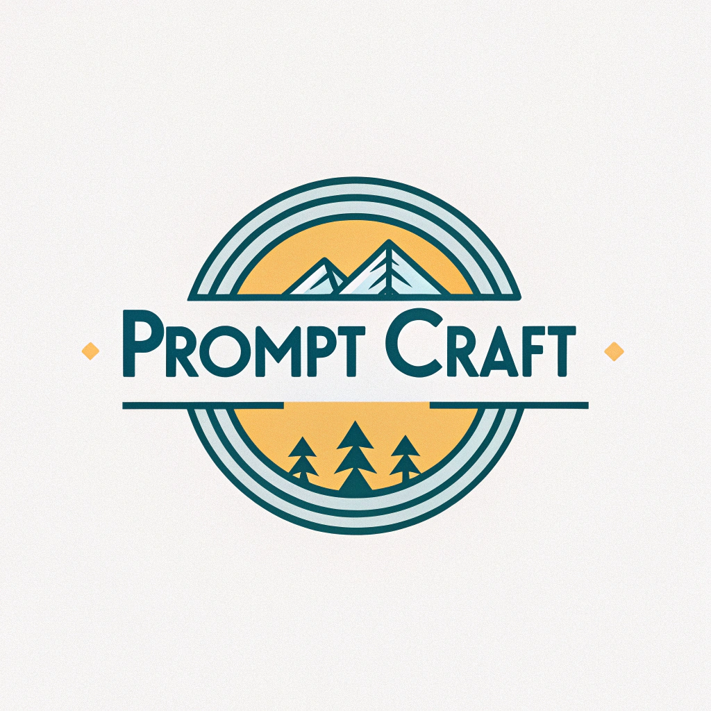

<div align="center">



# PromptCraft

**Bad prompts, bad answers. PromptCraft fixes that in one click.**

[](LICENSE)
[](https://github.com/colingalbraith/PromptCraft)
[](https://github.com/colingalbraith/PromptCraft)
[](manifest.json)

[Website](https://getpromptcraft.vercel.app) | [Report Bug](https://github.com/colingalbraith/PromptCraft/issues) | [Contributing](CONTRIBUTING.md)

</div>

---

https://github.com/user-attachments/assets/a64a511d-0ccc-4a24-b761-bea628b81a16

<div align="center">
<table>
  <tr>
    <td></td>
    <td></td>
    <td></td>
  </tr>
</table>
</div>

---

## Table of Contents

- [About](#about)
- [Features](#features)
- [Supported Providers](#supported-providers)
- [Supported AI Chat Sites](#supported-ai-chat-sites)
- [Installation](#installation)
- [How It Works](#how-it-works)
- [Templates](#templates)
- [Project Structure](#project-structure)
- [Contributing](#contributing)
- [Privacy](#privacy)
- [License](#license)

---

## About

PromptCraft is a free, open-source Chrome extension that enhances your AI prompts with a single click. It works across 8+ AI chat platforms with support for multiple API providers and local models.

Write like a human. Get expert-level prompts. Every time.

---

## Features

| Feature | Description |
|---|---|
| **One-Click Enhancement** | Select text on any AI chat, hit `Ctrl+Shift+E` or click the button |
| **14+ Templates** | Debug code, write emails, brainstorm, compare options, and more |
| **5 Tones + Custom Presets** | Concise, Detailed, Creative, Technical, Reasoning — or build your own |
| **Smart Input Analysis** | Detects code, errors, quotes, URLs, and intent automatically |
| **Deep Analysis** | Optional LLM-powered pass for semantic understanding before enhancing |
| **Word-Level Diff View** | See exactly what changed with green/red highlighting |
| **Multi-Step Enhancement** | Three-pass pipeline: Expand → Structure → Polish |
| **Provider-Aware** | Tailors prompts to the specific AI you're chatting with |
| **Prompt Scoring** | 0-100 quality score across 5 dimensions |
| **Streaming** | Real-time token streaming for supported providers |
| **Context-Aware** | Extracts and ranks chat history by relevance |
| **Prompt History** | Search, revisit, and export with before/after scores |
| **Usage Analytics** | Track enhancements, cost, tokens, and model breakdown |
| **Dark Mode** | Full dark theme with system preference detection |
| **Undo** | Revert any enhancement instantly |

---

## Supported Providers

| Provider | Type | Models |
|---|---|---|
| **OpenAI** | Cloud API | GPT-4o, GPT-4o Mini, GPT-4 Turbo, o3-mini |
| **Google Gemini** | Cloud API | Gemini 2.0 Flash, 1.5 Flash, 1.5 Pro |
| **Anthropic Claude** | Cloud API | Claude Sonnet 4, Claude Haiku 4.5 |
| **Ollama** | Local | Any model — llama3, mistral, etc. (free) |
| **Custom** | Any | OpenAI-compatible APIs — Groq, Together, OpenRouter, vLLM |

> **New to this?** We recommend starting with **Google Gemini** — it has a generous free tier and no credit card required. [Get a key here.](https://aistudio.google.com/app/apikey)

---

## Supported AI Chat Sites

<div align="center">

| Platform | Status |
|---|---|
| ChatGPT | Supported |
| Claude | Supported |
| Gemini | Supported |
| DeepSeek | Supported |
| Perplexity | Supported |
| Grok | Supported |
| HuggingFace | Supported |
| OpenRouter | Supported |

</div>

Each platform gets **tailored optimization hints** — PromptCraft knows the strengths of each AI and adjusts accordingly.

---

## Installation

### Quick Start

```bash
git clone https://github.com/colingalbraith/PromptCraft.git
```

### Load in Chrome

1. Open `chrome://extensions/`
2. Enable **Developer mode** (toggle in top right)
3. Click **Load unpacked**
4. Select the cloned `PromptCraft` folder

### Setup

1. Click the PromptCraft icon in your Chrome toolbar
2. The onboarding wizard will guide you through picking a provider
3. Paste your API key (or select Ollama for free local use)
4. Click **Get Started** — you're ready to enhance

> **Tip:** Gemini is the easiest way to start. Free API key, no credit card, takes 30 seconds.

---

## How It Works

```
1. Type your prompt           →  Don't worry about wording
2. Click the PromptCraft      →  Or press Ctrl+Shift+E
3. Prompt gets analyzed        →  Content type, intent, quality
4. Enhancement is generated    →  Streamed into your chat input
5. See the diff               →  Click "View changes" to compare
```

### Enhancement Pipeline

```
Your Input
    │
    ▼
┌─────────────────┐
│  Local Analysis  │  Segments content, detects intent, scores quality
└────────┬────────┘
         │
         ▼
┌─────────────────┐
│  Deep Analysis   │  (Optional) LLM-powered semantic understanding
└────────┬────────┘
         │
         ▼
┌─────────────────┐
│ Template + Tone  │  Applies style template with context + analysis hints
└────────┬────────┘
         │
         ▼
┌─────────────────┐
│  Provider Call   │  Sends to your configured AI provider
└────────┬────────┘
         │
         ▼
┌─────────────────┐
│ Preamble Strip   │  Removes any leaked commentary
└────────┬────────┘
         │
         ▼
   Enhanced Prompt  →  Streamed into your chat input
```

---

## Templates

PromptCraft includes 14 built-in templates across 4 categories:

| Category | Templates |
|---|---|
| **Coding** | Debug Code, Review Code, Refactor Code, Write Tests |
| **Writing** | Summarize Text, Write Blog Post, Draft Email, Improve Writing, Translate |
| **Research** | Explain Concept, Compare X vs Y, Research Question |
| **Creative** | Brainstorm Ideas, Create a Plan |

Each template supports variable fields (fill in the blanks) and pairs with any tone for full customization.

---

## Project Structure

```
PromptCraft/
├── manifest.json        # Chrome extension manifest (v3)
├── background.js        # Service worker — API gateway, streaming, provider routing
├── content.js           # Content script — DOM injection, context extraction, diff view
├── constants.js         # Config — system prompts, templates, models, platform hints
├── input-parser.js      # Input analysis — segmentation, intent detection, scoring
├── popup.html           # Extension popup UI
├── popup.js             # Popup logic — settings, templates, history, usage analytics
├── popup.css            # Styles with full dark mode support
├── panel.js             # Floating panel injection for non-chat sites
├── icon.png             # Main logo
├── icons/               # Extension icons (16, 48, 128px)
│   ├── icon16.png
│   ├── icon48.png
│   └── icon128.png
├── LICENSE              # MIT License
├── CONTRIBUTING.md      # Contribution guidelines
└── README.md            # You are here
```

---

## Contributing

We welcome contributions! Please read our [Contributing Guide](CONTRIBUTING.md) for details on:

- How to set up the development environment
- Branch structure (`main`, `Development`, `website`)
- Code style guidelines
- Testing requirements
- How to submit a pull request

---

## Privacy

PromptCraft takes privacy seriously:

- **No data collection** — we don't collect, store, or transmit any personal information
- **No tracking** — no analytics, cookies, or telemetry
- **No accounts** — no sign-up required
- **Local storage** — API keys and history stay on your device
- **Open source** — inspect every line of code yourself

Read the full [Privacy Policy](https://getpromptcraft.vercel.app/privacy.html).

---

## License

MIT License. See [LICENSE](LICENSE) for details.

---

<div align="center">

**Built by [Colin Galbraith](https://github.com/colingalbraith)**

If PromptCraft helped you, consider giving it a star!

[](https://github.com/colingalbraith/PromptCraft)

</div>
