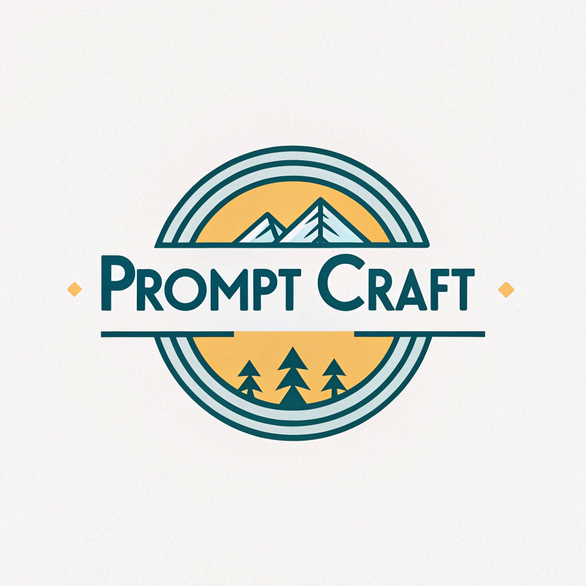

<div align="center">



# PromptCraft

**Bad prompts, bad answers. PromptCraft fixes that in one click.**

[](LICENSE)
[](https://github.com/colingalbraith/PromptCraft)
[](https://github.com/colingalbraith/PromptCraft)
[](manifest.json)

[Website](https://getpromptcraft.vercel.app) | [Report Bug](https://github.com/colingalbraith/PromptCraft/issues) | [Contributing](CONTRIBUTING.md)

</div>

---

https://github.com/user-attachments/assets/a64a511d-0ccc-4a24-b761-bea628b81a16

<div align="center">
<table>
  <tr>
    <td></td>
    <td></td>
    <td></td>
  </tr>
</table>
</div>

---

## Table of Contents

- [About](#about)
- [Features](#features)
- [Supported Providers](#supported-providers)
- [Supported AI Chat Sites](#supported-ai-chat-sites)
- [Installation](#installation)
- [How It Works](#how-it-works)
- [Troubleshooting](#troubleshooting)
- [Templates](#templates)
- [Project Structure](#project-structure)
- [Contributing](#contributing)
- [Privacy](#privacy)
- [License](#license)

---

## About

PromptCraft is a free, open-source Chrome extension that reviews and rewrites your AI prompts where you type them. It works across 8+ AI chat platforms, with your own API key, a local model, or the model built into your browser.

Write like a human. Get expert-level prompts. Every time.

---

## Features

| Feature | Description |
|---|---|
| **Badge in the Prompt Box** | A small badge sits in the corner of the chat box. Click it for a review of your draft, or press `Ctrl+Shift+E` to go straight to a rewrite |
| **Live Prompt Review** | A 0-100 score and up to three weak spots as you type, each with a one-click *Fix*. Scored locally: nothing is sent to a model until you ask for a rewrite |
| **No Setup Needed** | Where your browser has a built-in on-device model (Gemini Nano in recent desktop Chrome), PromptCraft can use it: no API key, no cost, and prompts never leave your computer |
| **Works on Any Site** | Right-click any text field → *Enhance with PromptCraft*, or use the shortcut — no extra permissions |
| **Suggest, Then Accept** | The rewrite streams into a card beside the box, on every provider. Your text only changes when you press *Accept* (or `Enter`); `Esc` dismisses it |
| **One-Click Refinement** | After a rewrite: *Shorter*, *More detail*, or *Try again* |
| **Side Panel** | The toolbar icon opens PromptCraft beside the page. It stays open as you switch tabs, and *Insert* drops the result into the page's text box |
| **14+ Templates** | Debug code, write emails, brainstorm, compare options, and more |
| **5 Tones + Custom Presets** | Concise, Detailed, Creative, Technical, Reasoning — or build your own. Switch tone from the badge's review card without opening the side panel |
| **No Invented Details** | Where only you know the answer, the rewrite leaves a `[bracketed blank]` and offers a field to fill it in |
| **Smart Input Analysis** | Detects code, errors, quotes, URLs, and intent automatically |
| **Deep Analysis** | Optional LLM-powered pass for semantic understanding before enhancing |
| **Word-Level Diff View** | *Compare* shows your draft and the rewrite side by side, with additions highlighted |
| **Multi-Step Enhancement** | Optional three-pass pipeline: Tone → Structure → Polish |
| **Provider-Aware** | Tailors prompts to the specific AI you're chatting with |
| **Prompt Scoring** | 0-100 quality score across 5 dimensions, shown before → after on every rewrite |
| **Context-Aware** | Extracts and ranks chat history by relevance |
| **Prompt History** | Search, revisit, and export with before/after scores |
| **Usage Analytics** | Track enhancements, cost, tokens, and model breakdown, using the token counts the provider reports |
| **Dark Mode** | Full dark theme with system preference detection; the in-page badge and cards follow the site's own theme |
| **Undo** | After accepting a rewrite, *Undo* puts your draft back |
| **Stays Out of the Way** | Outside chat sites nothing is added to a page until you use the shortcut or the right-click menu there |
| **Keyboard Accessible** | Visible focus, labelled controls, and keyboard-operable pickers throughout |

---

## Supported Providers

| Provider | Type | Models |
|---|---|---|
| **OpenAI** | Cloud API | GPT-6 Luna, GPT-6.1 Sol, GPT-6 Astra |
| **Google Gemini** | Cloud API | Gemini 3.5 Flash-Lite, 3.8 Flash, 3.1 Flash-Lite, 3.1 Pro |
| **Anthropic Claude** | Cloud API | Claude Opus 5.5, Sonnet 5.5, Haiku 4.5, Fable 5.1 |
| **Built-in** | On-device | The model built into your browser (Gemini Nano in Chrome). Free, no key. Offered only where the browser can run it |
| **Ollama** | Local | Any installed model (free) |
| **Custom** | Any | OpenAI-compatible APIs — Groq, Together, OpenRouter, LM Studio, vLLM |

The lists above are only the starting point: press **↻** next to the model picker in Settings to load the provider's current models, so new releases work without an extension update.

> **New to this?** If onboarding offers **Built-in**, pick it: there is nothing to set up. Chrome downloads the model once (a few GB) and needs roughly 22 GB of free disk space plus a recent graphics card or 16 GB of RAM. Its rewrites are simpler than a cloud model's.
>
> Otherwise start with **Google Gemini** — it has a generous free tier and no credit card required. [Get a key here.](https://aistudio.google.com/app/apikey)

---

## Supported AI Chat Sites

<div align="center">

| Platform | Status |
|---|---|
| ChatGPT | Supported |
| Claude | Supported |
| Gemini | Supported |
| DeepSeek | Supported |
| Perplexity | Supported |
| Grok | Supported |
| HuggingFace | Supported |
| OpenRouter | Supported |

</div>

Each platform gets **tailored optimization hints** — PromptCraft knows the strengths of each AI and adjusts accordingly.

---

## Installation

### Quick Start

```bash
git clone https://github.com/colingalbraith/PromptCraft.git
```

### Load in Chrome

1. Open `chrome://extensions/`
2. Enable **Developer mode** (toggle in top right)
3. Click **Load unpacked**
4. Select the cloned `PromptCraft` folder

### Setup

1. Click the PromptCraft icon in your Chrome toolbar — it opens in the side panel
2. The onboarding wizard will guide you through picking a provider
3. Pick **Built-in** if it is offered (no key needed), paste an API key, or select Ollama for free local use
4. Click **Get Started** — you're ready to enhance

> **Tip:** If **Built-in** isn't offered on your computer, Gemini is the easiest way to start. Free API key, no credit card, takes 30 seconds.

---

## How It Works

```
1. Type your prompt           →  The badge in the box counts what could be better
2. Click the badge            →  Score, weak spots, tone (or press Ctrl+Shift+E to skip ahead)
3. Improve prompt             →  The rewrite streams into a card beside the box
4. Fill in any blanks         →  Details only you know
5. Accept                     →  Or Shorter / More detail / Try again / Compare / Dismiss
6. Changed your mind?         →  Undo puts your draft back
```

The shortcut can be changed at `chrome://extensions/shortcuts`. Outside the supported chat sites the badge is not there until you ask for it: click into any text field and use the shortcut or the right-click menu.

### Enhancement Pipeline

```
Your Input
    │
    ▼
┌─────────────────┐
│  Local Analysis  │  Segments content, detects intent, scores quality
└────────┬────────┘
         │
         ▼
┌─────────────────┐
│  Deep Analysis   │  (Optional) LLM-powered semantic understanding
└────────┬────────┘
         │
         ▼
┌─────────────────┐
│ Template + Tone  │  Applies style template with context + analysis hints
└────────┬────────┘
         │
         ▼
┌─────────────────┐
│  Provider Call   │  One streaming request to your provider, or the built-in model
└────────┬────────┘
         │
         ▼
┌─────────────────┐
│ Preamble Strip   │  Removes any leaked commentary, as it streams
└────────┬────────┘
         │
         ▼
 Suggested Rewrite  →  Shown beside your chat input; written into it when you accept
```

---

## Troubleshooting

| Problem | Fix |
|---|---|
| **Ollama refused the request (403)** | Older Ollama versions block browser extensions. Set `OLLAMA_ORIGINS=chrome-extension://*` and restart Ollama |
| **Model not found** | Open Settings and press **↻** next to the model picker to load the provider's current models |
| **Custom endpoint can't be reached** | Chrome asks for access to that host when you save or test it — allow it. Local servers may also need CORS enabled |
| **`Ctrl+Shift+E` does nothing** | Another extension or the browser owns the shortcut. Rebind it at `chrome://extensions/shortcuts` |
| **"PromptCraft was updated. Reload this page"** | The extension was reloaded while the tab was open. Refresh the tab |

---

## Templates

PromptCraft includes 14 built-in templates across 4 categories:

| Category | Templates |
|---|---|
| **Coding** | Debug Code, Review Code, Refactor Code, Write Tests |
| **Writing** | Summarize Text, Write Blog Post, Draft Email, Improve Writing, Translate |
| **Research** | Explain Concept, Compare X vs Y, Research Question |
| **Creative** | Brainstorm Ideas, Create a Plan |

Each template supports variable fields (fill in the blanks) and pairs with any tone for full customization.

---

## Project Structure

```
PromptCraft/
├── manifest.json        # Chrome extension manifest (v3)
├── background.js        # Service worker — API gateway, streaming, provider routing
├── content.js           # Content script — DOM injection, context extraction, diff view
├── constants.js         # Config — system prompts, templates, models, platform hints
├── input-parser.js      # Input analysis — segmentation, intent detection, scoring
├── popup.html           # Side panel UI
├── popup.js             # Side panel logic — settings, templates, history, usage analytics
├── popup.css            # Styles with full dark mode support
├── fonts/               # Bundled Inter font (SIL Open Font License)
├── tests/               # Service worker tests — run with `node --test` (Node 22+, no dependencies)
├── scripts/package.js   # Builds the Chrome Web Store zip into dist/
├── CHANGELOG.md         # Release notes
├── icon.png             # Main logo
├── icons/               # Extension icons (16, 48, 128px)
│   ├── icon16.png
│   ├── icon48.png
│   └── icon128.png
├── LICENSE              # MIT License
├── CONTRIBUTING.md      # Contribution guidelines
└── README.md            # You are here
```

---

## Contributing

We welcome contributions! Please read our [Contributing Guide](CONTRIBUTING.md) for details on:

- How to set up the development environment
- Branch structure (`main`, `Development`, `website`)
- Code style guidelines
- Testing requirements
- How to submit a pull request

---

## Privacy

PromptCraft takes privacy seriously:

- **No data collection** — we don't collect, store, or transmit any personal information
- **No tracking** — no analytics, cookies, or telemetry
- **No accounts** — no sign-up required
- **Local storage** — API keys and history stay on your device, and web pages (including the chat sites the extension runs on) cannot read them
- **Direct to your provider** — your prompt, and the recent conversation when context is on, go only to the AI provider you configured. With the built-in model or Ollama they never leave your computer
- **Runs only where needed** — the extension is active on the supported chat sites, and on other pages only when you invoke it
- **No third-party requests** — fonts are bundled, so the only network traffic is to your AI provider
- **Open source** — inspect every line of code yourself

Read the full [Privacy Policy](https://getpromptcraft.vercel.app/privacy.html).

---

## License

MIT License. See [LICENSE](LICENSE) for details.

---

<div align="center">

**Built by [Colin Galbraith](https://github.com/colingalbraith)**

If PromptCraft helped you, consider giving it a star!

[](https://github.com/colingalbraith/PromptCraft)

</div>
